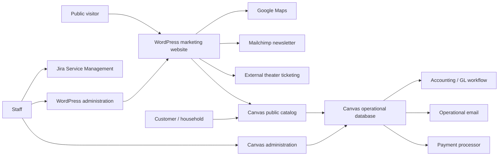
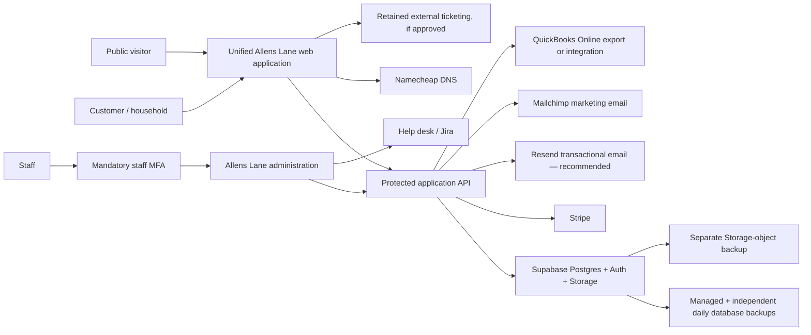

# Current-State System Map

## Current architecture

## Observed customer journeys

### Discover and register for a class

1. Visitor enters through the marketing website.
2. A Classes link sends the visitor to the Canvas catalog.
3. Canvas renders the class title, image, code, instructor, dates, time, level, age, price, fee, status, and description from the operational class record.
4. The customer registers an eligible participant or joins the waitlist.
5. The registration, payment, and customer history are stored in Canvas.
6. Staff manage the roster, transfers, drops, and communications in Canvas.

### Purchase or donate

1. Staff or a customer selects tuition, fees, membership, donation, pledge, ticket, or another sale item.
2. Canvas assembles a register/cart total.
3. Discounts, credits, scholarships, sales tax, and fees are applied.
4. Checkout is processed through the current payment integration.
5. Payment and financial-code information is retained for reporting and reconciliation.

### Publish a class

1. Programs staff create or copy a class within a semester.
2. Staff assign category, medium, level, instructor, code, pricing, capacity, ages, schedule, location, description, policies, and images.
3. Publication controls determine public availability and registration behavior.
4. The Canvas public catalog reflects the operational record.

## Target architecture

## Replacement boundary

The recommended replacement owns:

- Public editorial content and published catalog data
- Customer identity, households, and participants
- Class scheduling, enrollment, waitlists, transfers, and rosters
- Cart, orders, credits, fees, payments, and refunds
- Membership and giving history
- Staff administration, communications, reports, and audit history

The following may remain external behind explicit integrations:

- Card processing
- Marketing email
- Accounting ledger
- Public DNS
- Theater ticketing
- Help desk
- Maps/directions

## Problems the target must correct

- Content and operations are split across WordPress and Canvas.
- Visitors are handed between differently styled domains.
- Staff must understand a broad legacy administrative interface.
- Similar customer, commerce, and publishing concepts appear in multiple areas.
- Permission names are implementation-oriented rather than job-oriented.
- Reporting and exports may expose more information than each role needs.
- A full historical migration cannot be validated without a Canvas export, so the target must preserve Canvas as the read-only history and strictly reconcile the smaller manual cutover set.
