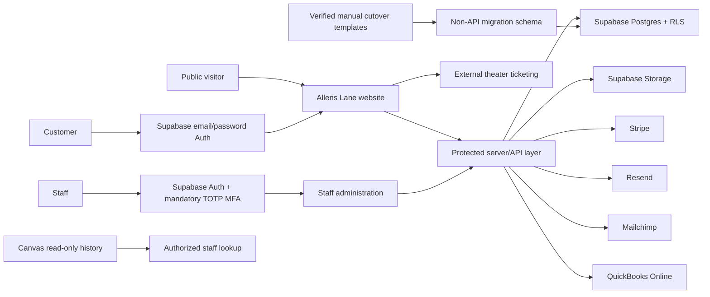

# Phase 2 Architecture

## System boundary

## Data schemas

| Schema | Purpose | API exposure |
|---|---|---|
| `auth` | Supabase identities, password sessions, MFA factors | Supabase Auth only |
| `public` | Application source of truth and RLS-protected RPCs | Data API with explicit grants and policies |
| `private` | Authorization, audit, validation, and bootstrap helpers | Not a Data API schema; limited execution grants only |
| `migration` | Manual cutover batches, raw/normalized rows, reconciliation controls | Not exposed; database/admin workflow only |
| `storage` | Supabase bucket/object metadata | Storage API with bucket/object RLS |

## Identity and authorization

Authentication proves identity; application roles grant permissions. Legacy classifications such as Donor, Instructor, Volunteer, or Former Staff never grant access.

Customer access is relationship-based:

1. Supabase verifies the email/password identity.
2. An Auth trigger creates the linked `people` record.
3. Customer onboarding creates or returns the primary household.
4. RLS derives access through active `household_members` relationships.
5. A primary person/guardian/household manager may maintain authorized household data.

Staff access is permission- and MFA-based:

1. The person has an active `staff_accounts` record.
2. The person has one or more non-revoked `user_roles` assignments.
3. The role grants an explicit permission through `role_permissions`.
4. The JWT session must report `aal2`.
5. RLS and protected functions check the same conditions; hiding a button is never treated as authorization.

## Hosting boundary

Supabase remains the only operational database. Cloudflare D1 and R2 stay disabled so the product does not split records between competing sources of truth. The public Supabase publishable key may be provided to browser code after RLS is deployed and tested. The Supabase secret/service-role key, Stripe secret, Resend key, webhook secrets, and backup credentials are server-only hosted secrets.

The currently published Sites frontend remains public and does not use ChatGPT authentication. Customer and staff Supabase sign-in screens will be added only after the live project URL, publishable key, approved redirect URLs, and server-side credential path are available.

## Financial trust boundary

- Stripe accepts payments through hosted/tokenized components.
- Stripe webhook IDs make payment ingestion idempotent.
- Customer refunds are never issued automatically through Stripe.
- An active Finance approver in an `aal2` session approves a paper-check refund or payment void.
- Check number/date and QuickBooks reference are required before reconciliation.
- Reconciled records are immutable and the audit log is append-only.

## Legacy boundary

Canvas is not modeled speculatively. It remains the historical read-only system. Only staff-verified current obligations cross the boundary through versioned templates and a reconciliation batch. Every manually cut over row records its source reference, batch, verifier, and target identity. A later Canvas export can enter the same staging boundary without changing operational tables.
